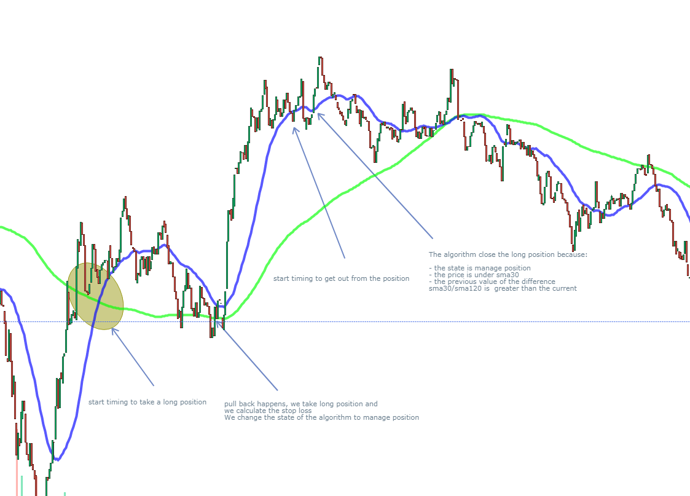

# bitfinexApi

This application is an online strategy trading REST API tool which can be used to automatically trade in bitfinex crypto-currency exchange.
It is easy to use through a REST interface:


This trading draft unlike other code examples it contains real trading strategy that works pretty good with high risk-reward ratio:

### How to use:

- checkout code
- compile it and run (maven based):

```
mvn clean compile
mvn spring-boot:start
```
- if the application fails to start because of an issue of a busy port, then change the value of the variable server.port in application.properties file and recompile and rerun the application 
- run a postman client and play with these endpoints:

```
http://localhost:8080/main-control/startBot/symbols/tETHUSD/algos/moving_avg
http://localhost:8080/main-control/stopBot
http://localhost:8080/main-control/getaccountbalance
```


### Current featues:

- Rest Interface to start/stop the trading bot  with the choice of a valid trading strategy plus a valid trading currency pair 

**Example:** using her the moving_avg strategy plus the ETH/USD pair
```
http://localhost:8080/main-control/startBot/symbols/tETHUSD/algos/moving_avg
```

- Moving average strategy implemented in the class ***MovingAverageStrategy***:  (NOTE: this strategy does not take real positions yet!!! but it computes the real P&L according to realtime market figures)
        it is a kind of state machine that takes decision to in timing to enter a long/short position depending on two moving averages + pull backs: the snapshot bellow summaries an entry postion and a sell that was performed by this algorithm:
     

### Tests 

- Tested moving average strategy in two days +2% where 12 positions where openned 5 neutral 3 losses 4 gains ( starting capital test 1000$ P&L:+20$ , position size ~ 95$ , SL: -0.95$)

### Future updates:

- Add short position handling in Moving average strategy 
- Add real openning positions
- ADX strategy
- Polynomial regression + bollinger bands
- websockets 
- timing entry position using the orderbook

